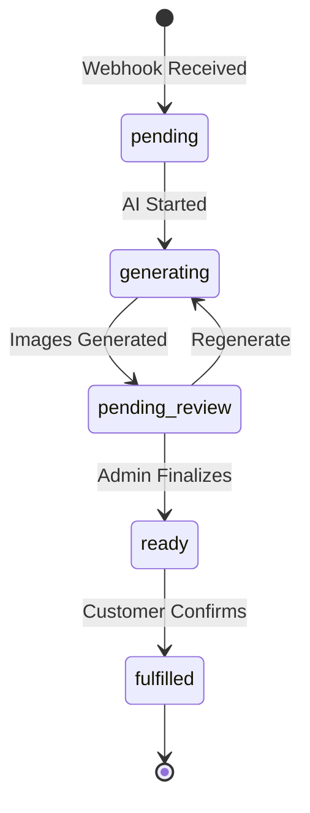

# Google AI Studio Context - Pet Portrait Redemption Portal

**Last Updated**: 2026-02-02  
**Project**: Taylored Pet Portraits - Human-in-the-Loop AI Portrait System

---

## Executive Summary

A Next.js + Supabase application that transforms Shopify pet portrait orders into custom AI-generated artwork through a quality-controlled admin curation workflow. The system implements **Human-in-the-Loop** architecture where admin approval is required before customers see their portraits.

### Key Architectural Decisions (Recent Pivots)

1. **Human-in-the-Loop Curation**: Admin swipe approval required before customer access
2. **Native Shopify Integration**: Direct webhook at `/api/webhooks/shopify` (no Zapier)
3. **CSS Overlay Mockups**: Product mockups use CSS overlays, NOT Printify API generation

---

## Tech Stack

### Frontend
- **Framework**: Next.js 14 (App Router)
- **Language**: TypeScript
- **Styling**: Tailwind CSS
- **Animations**: Framer Motion
- **Icons**: Lucide React

### Backend
- **API**: Next.js API Routes (App Router)
- **Database**: Supabase (PostgreSQL)
- **Auth**: Session-based (admin), Order ID + Email (customer)
- **Storage**: Supabase Storage

### External Services
- **AI Generation**: Custom Edge Functions (Gemini models)
- **Email**: Resend API
- **Payment**: Stripe Checkout + Webhooks
- **E-commerce**: Shopify (webhook integration)
- **Fulfillment**: Printify API (post-selection only)

### Deployment
- **Platform**: Netlify
- **Database**: Supabase Cloud

---

## Complete Order Flow

```
Customer Purchase (Shopify)
  ↓
Native Webhook Handler (/api/webhooks/shopify)
  ↓
AI Generates 15+ Portraits (status: 'generated')
  ↓
Admin Reviews in Dashboard (Swipe Approve/Reject)
  ↓
Admin Finalizes Order (status: 'ready')
  ↓
Customer Receives Email + Gallery Link
  ↓
Customer Selects Favorite Portrait
  ↓
Customer Confirms Selection
  ↓
Admin Manually Triggers Printify Fulfillment
```

### Detailed Workflow Stages

#### 1. Order Ingestion (Automated)
- **Trigger**: Shopify webhook `orders/paid` event
- **Endpoint**: `POST /api/webhooks/shopify`
- **Security**: HMAC signature verification
- **Process**:
  1. Verify Shopify HMAC
  2. Download pet photo from Shopify CDN
  3. Upload to Supabase Storage
  4. Create order record (`status='pending'`)
  5. Fire AI generation async
  6. Return 200 OK immediately

#### 2. AI Image Generation
- **Method**: Supabase Edge Functions (Gemini models)
- **Output**: 15 portrait variations
- **Storage**: Supabase Storage buckets
- **Database**: Images saved with `status='generated'`
- **Order Status**: `'pending'` or `'generating'`

#### 3. Admin Curation (Human-in-the-Loop)
- **Interface**: Admin Dashboard with SwipeCard component
- **Actions**: 
  - Swipe Right → `status='approved'`
  - Swipe Left → `status='rejected'` (optional rejection_reason)
- **Progress**: Shows "X of 15 reviewed"
- **Finalize Button**: Enabled when ≥5 images approved

#### 4. Customer Notification
- **Trigger**: Admin clicks "Finalize Order"
- **Action**: Order status → `'ready'`
- **Email**: Resend API sends gallery link
- **Template**: Personalized with customer name, pet name, portal link

#### 5. Customer Selection
- **Portal**: `/portal/[orderId]`
- **Verification**: Email + Order ID
- **Visible Images**: Only `status='approved'` images
- **Interface**: SwipeCard component (customer context)
- **Upsells**: Optional bonus themes ($15 via Stripe)

#### 6. Fulfillment (Manual)
- **Trigger**: Admin action after customer selection
- **Method**: Printify API (`PrintifyService.createOrder()`)
- **Note**: Fulfillment is manual, not automatic on selection

---

## Database Schema

### Core Tables

#### `orders` Table
```sql
CREATE TABLE orders (
  id uuid PRIMARY KEY,
  customer_name text NOT NULL,
  customer_email text NOT NULL,
  pet_name text,
  pet_image_url text,
  pet_breed text,
  product_type text,
  
  -- Workflow status
  status text CHECK (status IN (
    'pending',        -- Initial state
    'generating',     -- AI creating images
    'pending_review', -- Ready for admin
    'ready',         -- Customer notified
    'fulfilled',     -- Customer selected
    'failed'
  )),
  
  payment_status text CHECK (payment_status IN ('unpaid', 'paid')),
  bonus_unlocked boolean DEFAULT false,
  
  -- Customer engagement
  social_consent boolean DEFAULT false,
  social_handle text,
  rating integer,
  review_text text,
  
  created_at timestamptz DEFAULT now(),
  viewed_at timestamptz
);
```

#### `images` Table
```sql
CREATE TABLE images (
  id uuid PRIMARY KEY,
  order_id uuid REFERENCES orders(id) ON DELETE CASCADE,
  
  url text NOT NULL,
  storage_path text NOT NULL,
  
  -- Image classification
  type text CHECK (type IN ('primary', 'upsell', 'mockup', 'mobile_wallpaper')),
  
  -- Admin curation (CRITICAL)
  status text NOT NULL DEFAULT 'generated' CHECK (status IN (
    'generated',  -- AI created, awaiting review
    'approved',   -- Admin approved, visible to customer
    'rejected'    -- Admin rejected, hidden from customer
  )),
  
  rejection_reason text, -- Optional admin feedback
  
  -- Customer interaction
  is_selected boolean DEFAULT false,
  is_bonus boolean DEFAULT false,
  
  -- Metadata
  theme_name text,
  display_order integer DEFAULT 0,
  
  created_at timestamptz DEFAULT now()
);
```

### Supporting Tables
- `printify_product_configs` - Fulfillment product settings
- `themes` - Optional bonus theme catalog
- `mockup_templates` - CSS overlay templates for product mockups

---

## API Routes

### Admin Routes (Protected)

```
POST   /api/admin/orders/create
GET    /api/admin/orders
POST   /api/admin/images/upload
POST   /api/admin/images/[imageId]/approve
POST   /api/admin/images/[imageId]/reject
POST   /api/admin/orders/[orderId]/finalize
GET    /api/admin/printify-products           [DEPRECATED]
POST   /api/admin/printify-products           [DEPRECATED]
PATCH  /api/admin/printify-products/[id]      [DEPRECATED]
DELETE /api/admin/printify-products/[id]      [DEPRECATED]
```

### Customer Routes (Public)

```
GET    /api/customer/[orderId]/images
POST   /api/customer/[orderId]/confirm
POST   /api/customer/[orderId]/unlock
```

### Webhook Routes

```
POST   /api/webhooks/shopify    (HMAC verified)
POST   /api/webhooks/stripe
```

---

## Component Architecture

### Shared Components

#### `SwipeCard.tsx` (Dual Context)
**Location**: `src/components/shared/SwipeCard.tsx`

**Props**:
```typescript
interface SwipeCardProps {
  order: Order;
  primaryImage: Image | null;
  aiResultImage: Image | null;
  context: 'admin' | 'customer';
  onApprove: () => void;
  onReject: () => void;
}
```

**Contexts**:
- **Admin**: Shows full order details, "Approve/Reject" buttons, social consent badges
- **Customer**: Minimal UI, "Select This/Pass" buttons

**Features**:
- Drag gesture support (Framer Motion)
- Swipe threshold: 150px
- Visual feedback (rotation, opacity transforms)

### Admin Components

- `CommandCenterModal.tsx` - Full-screen curation interface
- `AdminDashboard.tsx` - Order management dashboard
- `ManualOrderModal.tsx` - Manual order creation

### Customer Components

- `CustomerGallery.tsx` - Interactive gallery (approved images only)
- `OrderPage.tsx` - Main customer portal page

---

## CSS Mockup System

> **IMPORTANT**: As of 2026-02-02, product mockups use CSS overlays, NOT Printify API generation.

### How It Works

1. **Overlay Templates**: PNG images stored in Supabase Storage
2. **CSS Composition**: Portrait layered behind overlay using CSS `background-image`
3. **Instant Rendering**: No API calls, immediate display
4. **Scalability**: Easy to add new product types

### Implementation

```typescript
// Mockup rendering (example)
<div className="mockup-container">
  
  
</div>
```

### Database Support

```sql
-- mockup_templates table stores overlay images
CREATE TABLE mockup_templates (
  id uuid PRIMARY KEY,
  product_type text NOT NULL,
  template_url text NOT NULL,  -- Supabase Storage URL
  display_name text,
  created_at timestamptz DEFAULT now()
);
```

---

## Authentication & Security

### Admin Access
- **Method**: Session-based authentication
- **Middleware**: Route protection on `/admin/*`
- **RLS**: Full database access via authenticated role

### Customer Access
- **Method**: Order ID + Email verification
- **Session**: Stateless, verified per request
- **RLS**: Only see approved images (`status='approved'`)

### Row Level Security Policies

```sql
-- Customers see approved images only
CREATE POLICY "Customers see approved images only"
  ON images FOR SELECT TO anon
  USING (status = 'approved');

-- Admin sees all images
CREATE POLICY "Admin sees all images"
  ON images FOR SELECT TO authenticated
  USING (true);
```

---

## Email Templates (Resend)

### Gallery Ready Notification

**Trigger**: Admin finalizes order  
**Template**:
```
Subject: 🎨 Your Pet Portraits Are Ready, {customer_name}!

Hi {customer_name},

Your custom {pet_name} portraits are ready to view!

→ View Your Gallery: {portal_link}

You'll be able to:
✓ Browse all your portrait variations
✓ Select your favorite
✓ Download high-resolution images
✓ Unlock bonus themes (optional)
```

---

## Order Status State Machine



---

## File Structure

```
project/
├── src/
│   ├── app/
│   │   ├── admin/                  # Admin dashboard
│   │   ├── portal/[orderId]/       # Customer portal
│   │   └── api/
│   │       ├── admin/             # Admin API routes
│   │       ├── customer/          # Customer API routes
│   │       └── webhooks/          # Shopify, Stripe webhooks
│   ├── components/
│   │   ├── shared/
│   │   │   └── SwipeCard.tsx      # Dual-context component
│   │   ├── CustomerGallery.tsx
│   │   └── OrderPage.tsx
│   └── lib/
│       ├── api/                   # API client functions
│       ├── supabase/              # Database clients
│       └── printify/              # [DEPRECATED for mockups]
├── supabase/
│   └── migrations/
└── docs/
    ├── system-architecture.md
    └── google-ai-studio-context.md  # This file
```

---

## Environment Variables

### Required
```env
# Supabase
NEXT_PUBLIC_SUPABASE_URL=
NEXT_PUBLIC_SUPABASE_ANON_KEY=
SUPABASE_SERVICE_ROLE_KEY=

# Shopify
SHOPIFY_WEBHOOK_SECRET=

# Stripe
NEXT_PUBLIC_STRIPE_PUBLISHABLE_KEY=
STRIPE_SECRET_KEY=
STRIPE_WEBHOOK_SECRET=

# Resend (Email)
RESEND_API_KEY=

# Admin
ADMIN_EMAIL=
```

### Optional
```env
# Printify (for fulfillment only)
PRINTIFY_API_TOKEN=
PRINTIFY_SHOP_ID=
```

---

## Recent Changes (2026-02-02)

### ✅ Implemented
1. Added `rejection_reason` column to `images` table
2. Removed Printify mockup generation APIs (`/api/generate-mockup/`, `/api/admin/test-mockup/`)
3. Added deprecation notices to Printify service files
4. Documented CSS Overlay mockup system

### 🗑️ Deprecated Files
- `src/lib/printify/service.ts` - `generateMockupImage()` method
- `src/app/api/admin/printify-products/` - Kept for fulfillment config only

### 📝 Documentation Updates
- Created `google-ai-studio-context.md`
- Updated `system-architecture.md` with CSS mockup clarification

---

## Common Workflows

### Admin: Process New Order

1. Receive notification: "New order ready for review"
2. Open Admin Dashboard → Click order
3. Review each image via SwipeCard
4. Swipe right (approve) or left (reject)
5. When satisfied (≥5 approved), click "Finalize Order"
6. System sends email to customer
7. Monitor customer selection
8. Manually trigger Printify fulfillment after confirmation

### Customer: Select Portrait

1. Receive email with portal link
2. Click link → Verify email + order ID
3. Browse approved portraits (swipeable gallery)
4. Select favorite portrait
5. Optionally unlock bonus themes ($15)
6. Confirm selection
7. Download high-res images

---

## Troubleshooting

### Issue: Images not showing in customer portal
**Check**:
1. Are images marked `status='approved'` in database?
2. Has admin finalized the order (`order.status='ready'`)?
3. Is RLS policy allowing anon access to approved images?

### Issue: Mockups not displaying
**Check**:
1. Is `mockup_templates` table populated with overlay URLs?
2. Are overlay images accessible in Supabase Storage (public bucket)?
3. Is CSS correctly layering portrait + overlay?

### Issue: Shopify webhook not triggering
**Check**:
1. HMAC signature verification passing?
2. Webhook URL correctly configured in Shopify admin?
3. `SHOPIFY_WEBHOOK_SECRET` matches Shopify settings?

---

## Future Enhancements

- Batch order processing interface
- AI regeneration based on rejection feedback
- Analytics dashboard (conversion tracking)
- Template customization per product type
- Automated social media posting (when consent given)
- Mobile app for admin curation

---

**For detailed system architecture, see**: `docs/system-architecture.md`
