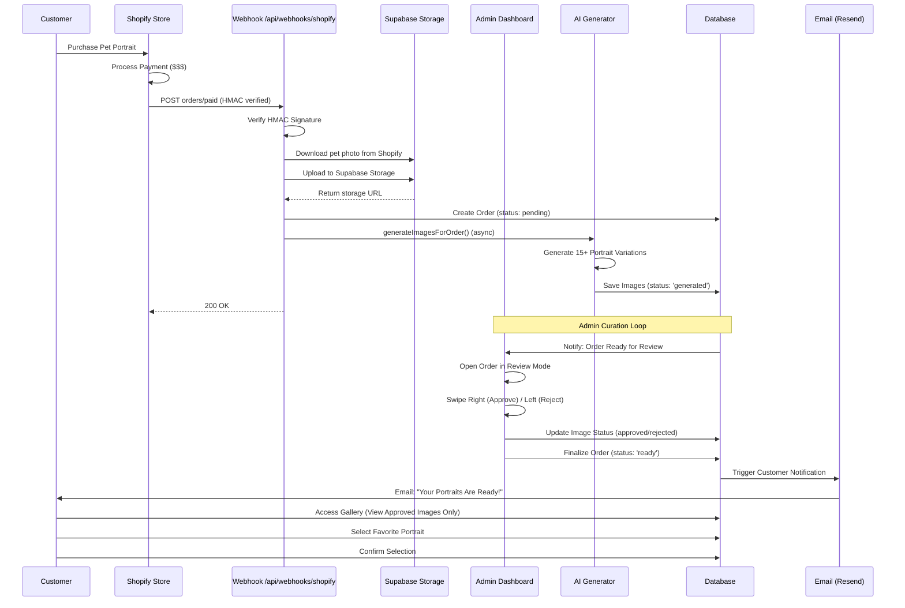
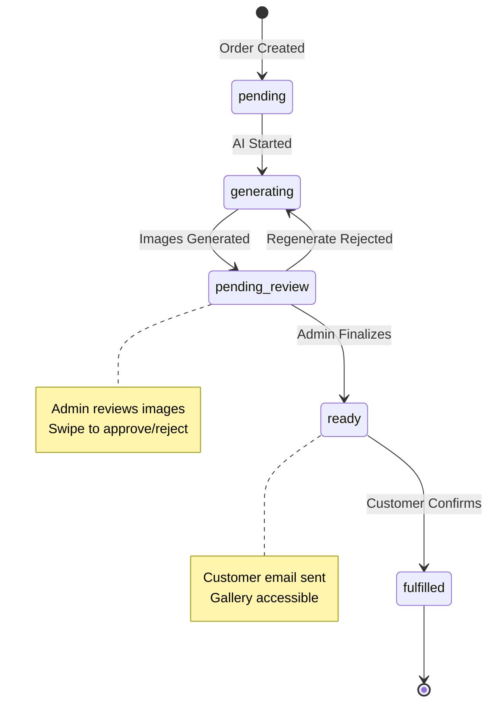

# Pet Portrait Redemption - System Architecture

## Overview

The Pet Portrait Redemption Portal is a full-stack application that enables digital pet portrait businesses to deliver custom AI-generated artwork to customers through an interactive gallery experience. The system includes a **Human in the Loop** admin curation workflow to ensure quality control before customer delivery.

## Core Architecture

### Tech Stack

- **Frontend**: Next.js 14 (App Router), TypeScript, Tailwind CSS
- **Backend**: Next.js API Routes, Supabase (PostgreSQL)
- **Storage**: Supabase Storage (images, media)
- **Payments**: Stripe Checkout + Webhooks
- **Email**: Resend API
- **Hosting**: Netlify
- **UI Libraries**: Framer Motion (animations), Lucide React (icons)

---

## Customer Journey with Admin Curation

### Complete Order Flow



### Step-by-Step Breakdown

#### 1. Order Ingestion (Automated)
- **Shopify Webhook** → `/api/webhooks/shopify` (HMAC verified, no Zapier)
- Native webhook handler downloads pet photo, uploads to Supabase Storage
- Order created with `status='pending'`
- Customer details, pet info, and product type extracted from line item properties
- **AI generation triggered immediately** (fire-and-forget)

#### 2. Image Generation
- AI generates 15 portrait variations
- Images uploaded to Supabase Storage
- Images saved to database with `status='generated'`
- Order status remains `'pending'` or changes to `'generating'`

#### 3. Admin Review Loop (Human in the Loop)
- Admin opens order from dashboard
- **SwipeCard** interface displays stack of images
- **Swipe Right** → Mark as `approved`
- **Swipe Left** → Mark as `rejected` (option to regenerate)
- Admin can see count of approved vs rejected images
- Progress indicator: "8 of 15 reviewed"

#### 4. Finalize & Publish
- Admin clicks **"Finalize Order"** button (enabled when ≥5 approved)
- System updates `order.status = 'ready'`
- Triggers **Resend email** to customer with gallery link

#### 5. Customer Notification
- Customer receives email: "Your Portraits Are Ready!"
- Email contains unique order link: `/portal/{orderId}`
- Customer clicks link to access gallery

#### 6. Customer Selection
- Customer verifies with **email + order ID**
- Gallery displays **only approved images** (`status='approved'`)
- Customer browses with swipeable interface
- Customer selects favorite portrait
- Optional: Unlock bonus themes via Stripe ($15)

#### 7. Order Confirmation
- Customer confirms selection
- Order marked as `fulfilled`
- Customer can download high-res images

---

## Database Schema

### Orders Table

```sql
CREATE TABLE orders (
  id uuid PRIMARY KEY DEFAULT gen_random_uuid(),
  customer_name text NOT NULL,
  customer_email text NOT NULL,
  pet_name text,
  pet_image_url text,
  pet_breed text,
  product_type text,
  
  -- Status tracking (CRITICAL for workflow)
  status text CHECK (status IN (
    'pending',           -- Initial state
    'generating',        -- AI is creating images
    'pending_review',    -- Images ready for admin review
    'ready',            -- Admin approved, customer notified
    'fulfilled',        -- Customer selected and confirmed
    'failed'            -- Error state
  )),
  
  payment_status text CHECK (payment_status IN ('unpaid', 'paid')),
  bonus_unlocked boolean DEFAULT false,
  
  -- Customer engagement
  social_consent boolean DEFAULT false,
  social_handle text,
  rating integer,
  review_text text,
  
  -- Timestamps
  created_at timestamptz DEFAULT now(),
  viewed_at timestamptz,
  
  CONSTRAINT orders_status_default DEFAULT 'pending'
);
```

### Images Table

```sql
CREATE TABLE images (
  id uuid PRIMARY KEY DEFAULT gen_random_uuid(),
  order_id uuid REFERENCES orders(id) ON DELETE CASCADE,
  
  url text NOT NULL,
  storage_path text NOT NULL,
  
  -- Image classification
  type text CHECK (type IN ('primary', 'upsell', 'mockup', 'mobile_wallpaper')),
  
  -- CRITICAL: Admin curation status
  status text NOT NULL DEFAULT 'generated' CHECK (status IN (
    'generated',  -- AI created, awaiting admin review
    'approved',   -- Admin approved, visible to customer
    'rejected'    -- Admin rejected, hidden from customer
  )),
  
  -- Admin feedback for rejected images
  rejection_reason text,
  
  -- Customer interaction
  is_selected boolean DEFAULT false,
  is_bonus boolean DEFAULT false,
  
  -- Metadata
  theme_name text,
  display_order integer DEFAULT 0,
  
  created_at timestamptz DEFAULT now()
);

-- Performance indexes
CREATE INDEX images_order_id_idx ON images(order_id);
CREATE INDEX images_status_idx ON images(status);
CREATE INDEX images_type_idx ON images(type);
```

> **Note on Mockup Generation**: As of 2026-02-02, product mockups (showing portraits on canvases, mugs, etc.) are generated using a **CSS Overlay System**, not external APIs. Overlay templates are stored in the `mockup_templates` table and composited with portraits using CSS. This provides instant rendering and eliminates API dependencies.

### Key Relationships

- **One Order** → **Many Images** (1:N)
- Customer can only see images where `status='approved'`
- Admin sees all images with filters by status

---

## Component Architecture

### Shared Components

#### SwipeCard Component
**Location**: `src/components/shared/SwipeCard.tsx`

**Dual Context Support**:
- **Admin Context**: Review/curation (Approve/Reject)
- **Customer Context**: Selection (Choose Favorite)

```typescript
interface SwipeCardProps {
  order: Order;
  image: Image;
  context: 'admin' | 'customer';
  onApprove: () => void;
  onReject: () => void;
}
```

**Admin UI Features**:
- Display customer name, email, product type
- Show social consent status
- Approve/Reject buttons with green/red styling
- Swipe gestures for quick review

**Customer UI Features**:
- Clean image display
- "Select This One" action
- Celebrations on selection

### Admin Components

#### CommandCenterModal
**Location**: `src/app/admin/_components/CommandCenterModal.tsx`

Full-screen admin review interface with:
- Image curation stack
- Bulk approve actions
- Progress tracking
- Finalize order button

#### AdminDashboard
**Location**: `src/app/admin/AdminDashboard.tsx`

Order management dashboard:
- Order list with status badges
- Search/filter functionality
- Quick actions (Review, Portal Preview)

### Customer Components

#### CustomerGallery
**Location**: `src/components/CustomerGallery.tsx`

Interactive customer gallery:
- Only displays `status='approved'` images
- Swipeable card interface
- Lightbox preview
- Download options

---

## API Routes

### Admin Endpoints (Protected)

```
POST /api/admin/orders/create
  → Create new order
  
POST /api/admin/images/upload
  → Upload images with status='generated'

POST /api/admin/images/[imageId]/approve
  → Update image.status = 'approved'

POST /api/admin/images/[imageId]/reject
  → Update image.status = 'rejected'

POST /api/admin/orders/[orderId]/finalize
  → Update order.status = 'ready'
  → Send customer email notification
```

### Customer Endpoints (Public)

```
GET /api/customer/[orderId]/images
  → Fetch images WHERE status='approved'
  
POST /api/customer/[orderId]/confirm
  → Save customer selection

POST /api/customer/[orderId]/unlock
  → Unlock bonus themes
```

### Webhook Endpoints (Public, HMAC Verified)

```
POST /api/webhooks/shopify
  → Receive Shopify orders/paid events (replaces Zapier)
  → HMAC signature verification (X-Shopify-Hmac-Sha256)
  → Download pet photo from Shopify URL
  → Upload to Supabase Storage
  → Create order in database (status=pending)
  → Trigger generateImagesForOrder() async
  → Returns 200 OK to Shopify immediately
  
POST /api/webhooks/stripe
  → Handle Stripe payment events
  → Unlock bonus content on successful payment
```

---

## Order Status State Machine



---

## Security

### Row Level Security (RLS)

```sql
-- Orders: Public read access for customer portal
CREATE POLICY "Allow public read access to orders"
  ON orders FOR SELECT TO anon, authenticated
  USING (true);

-- Images: Customer can only see approved images
CREATE POLICY "Customers see approved images only"
  ON images FOR SELECT TO anon
  USING (status = 'approved');

-- Images: Authenticated (admin) sees all
CREATE POLICY "Admin sees all images"
  ON images FOR SELECT TO authenticated
  USING (true);
```

### Authentication

- **Admin**: Session-based auth with middleware protection
- **Customer**: Order ID + Email verification (no account required)

---

## Email Flow (Resend)

### Customer Notification Email

**Trigger**: Admin clicks "Finalize Order"

**Template**:
```
Subject: 🎨 Your Pet Portraits Are Ready, {customer_name}!

Hi {customer_name},

Your custom {pet_name} portraits are ready to view!

→ View Your Gallery: {portal_link}

You'll be able to:
✓ Browse all your portrait variations
✓ Select your favorite
✓ Download high-resolution images
✓ Unlock bonus themes (optional)

See you soon!
```

---

## File Structure

```
project/
├── src/
│   ├── app/
│   │   ├── admin/              # Admin dashboard
│   │   │   ├── AdminDashboard.tsx
│   │   │   └── _components/
│   │   │       ├── CommandCenterModal.tsx
│   │   │       └── ManualOrderModal.tsx
│   │   ├── portal/[orderId]/  # Customer portal
│   │   ├── api/
│   │   │   ├── admin/         # Admin API routes
│   │   │   ├── customer/      # Customer API routes
│   │   │   └── webhooks/      # Payment webhooks
│   ├── components/
│   │   ├── shared/
│   │   │   └── SwipeCard.tsx  # Shared between contexts
│   │   ├── CustomerGallery.tsx
│   │   └── OrderPage.tsx
│   ├── lib/
│   │   ├── api/               # API client functions
│   │   └── supabase/          # Database clients
├── supabase/
│   └── migrations/            # Database migrations
└── docs/
    └── system-architecture.md # This file
```

---

## Key Workflows

### Admin: Create Order → Notify Customer

1. Admin creates order (Shopify or manual)
2. AI generates 15 portrait variations
3. Images saved with `status='generated'`
4. Admin receives notification: "Order ready for review"
5. Admin opens order, reviews each image
6. Admin swipes to approve/reject
7. When satisfied (≥5 approved), clicks "Finalize Order"
8. System sends Resend email to customer
9. Customer accesses gallery

### Customer: View Gallery → Select Portrait

1. Customer receives email
2. Clicks portal link
3. Verifies with email + order ID
4. Browses approved images only
5. Swipes through options
6. Selects favorite
7. Optionally unlocks bonus themes ($15)
8. Downloads high-res images

---

## Deployment

- **Platform**: Netlify
- **Build Command**: `npm run build`
- **Environment Variables**: Supabase keys, Stripe keys, Resend API key
- **Database**: Supabase (hosted PostgreSQL)
- **File Storage**: Supabase Storage buckets

---

## Future Enhancements

- Batch order processing
- AI regeneration based on rejection feedback
- Analytics dashboard for conversion tracking
- Template customization per product type
- Automated social media posting
